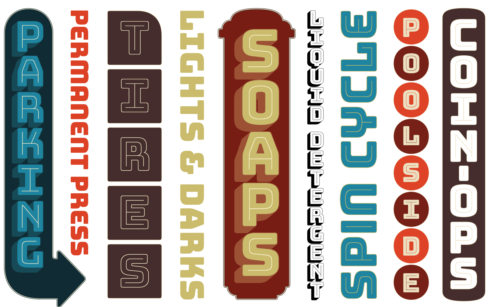
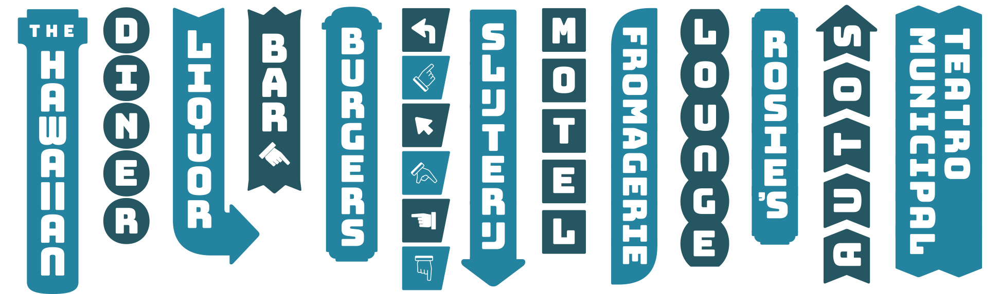

# Bungee

In the crowded urban environment, space for signage is always at a premium. From dumpy liquor stores to majestic theaters, sometimes signs have nowhere to go but up. Bungee is a font family that celebrates urban signage by wrangling the Latin alphabet to work vertically as well as horizontally; with separately glyphs, spacing, and kerning for each orientation. Bungee comes equipped with chromatic inlines, outlines, shades, and ornaments, making it the perfect toolkit to take your text in a new direction.

Learn more about Bungee at [djr.com/bungee](https://djr.com/bungee).

## Specimen

## Family structure

Bungee contains several different font sets that allow access to the chromatic layers and vertical forms. 

The basic *Bungee* family includes Regular and Hairline weights, as well as three composite layerings: Inline, Outline, and Shade.

*Bungee Layers* contains each layer in a separate font, which can be used in combination to create chromatic text.

*Bungee Layers Rotated* implements Bungee’s vertical forms by default, with all characters rotated 90° counterclockwise. These fonts can be set in a textbox rotated 90° clockwise to simulate vertical type.

*Bungee Color* contains experiments with the various color font formats out there, including SVG, COLR/CPAL and sbix. None of these formats are widely supported (yet!), so your milage may vary. These fonts are built with Jens Kutílek’s [RoboChrome](https://github.com/fontfont/RoboChrome), and produced with help from [Roel Nieskens](https://pixelambacht.nl).

[Check out the docs](/documentation) to learn more about how to use Bungee’s chromatic layers, vertical forms, stylistic alternates, and ornaments.

Bungee was designed in [RoboFont](http://www.robofont.com) and its drawing and build sources are available in [UFO format](http://www.unifiedfontobject.org).

## License

Thanks to support from Google and The Font Bureau, Bungee is released under the SIL Open Font License. This license is available with a FAQ at <http://scripts.sil.org/OFL>

## Repository Layout

This font repository follows the Unified Font Repository v2.0, a standard way to organize font project source files. 
Learn more at <https://github.com/raphaelbastide/Unified-Font-Repository>
