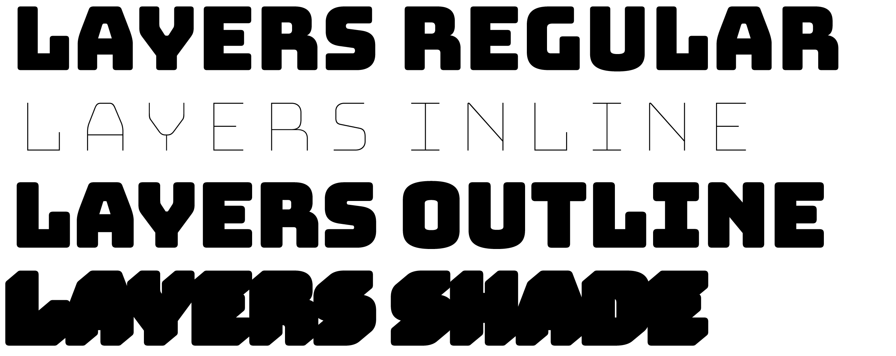
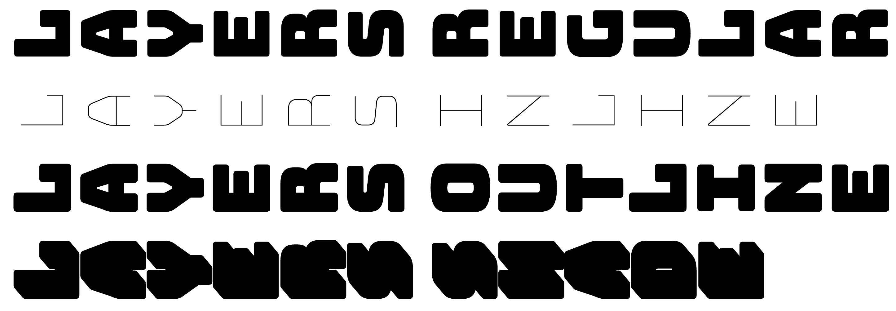

# Family structure

Bungee contains several different font sets that allow access to the chromatic layers and vertical forms. 

The basic **Bungee** family includes Regular and Hairline weights, as well as three composite layerings: Inline, Outline, and Shade. To account for the shadow, Shade is spaced 150 units wider than the others.

**Bungee Layers** contains each layer in a separate font, which all share the same metrics. These fonts can be used in combination to create chromatic text by using layered textboxes in a website or advanced design app.

**Bungee Layers Rotated** implements Bungee’s vertical forms by default, with all characters rotated 90° counterclockwise. These fonts can be set in a textbox rotated 90° clockwise to simulate vertical type, and have a limited character set.

**Bungee Color** contains experiments with the various color font formats out there, including SVG, COLR/CPAL and sbix. None of these formats are widely supported (yet!), so your milage may vary. These fonts are built with Jens Kutilek’s <a href="https://github.com/fontfont/RoboChrome">RoboChrome</a>.

* Next: [Chromatic layers](2-chromatic-layers.md)