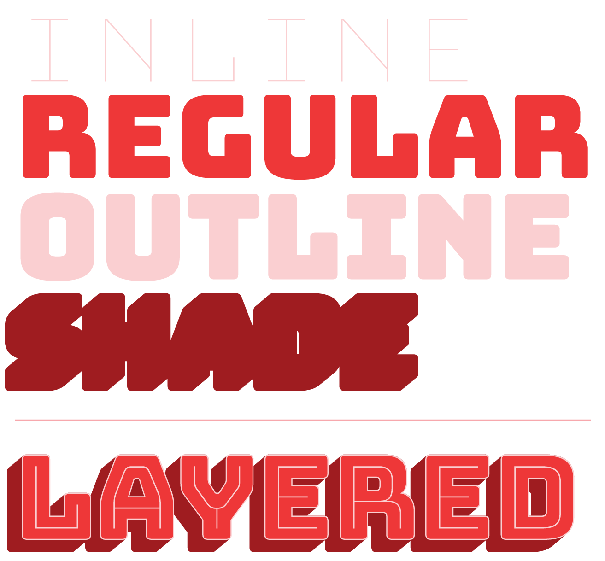
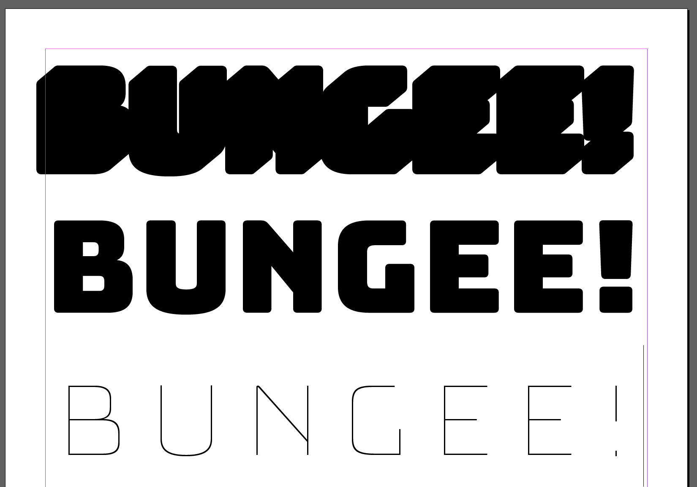
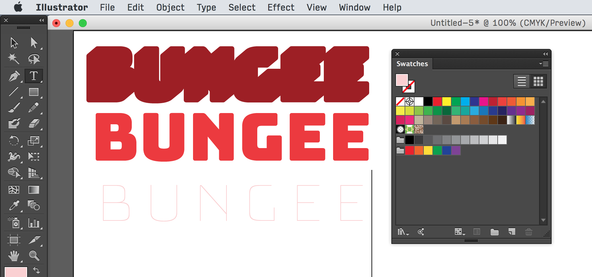
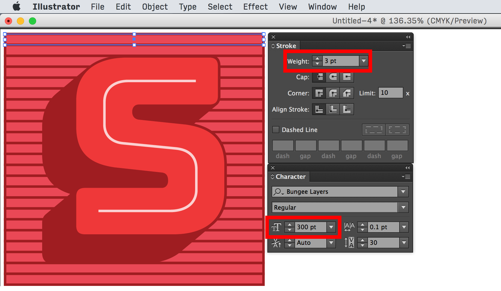

# Using chromatic layers

## Available layers

Besides the Regular style, Bungee also comes with Inline, Outline, and Shade layer fonts. These fonts can be stacked on top of one another to create dimensional and richly chromatic words and phrases.

When using vertical text with Bungee’s shade layer, it may be advisable to add some tracking or letterspacing.

## In design apps

No design apps have native support for chromatic layers.

In one text box, set a line of matching text for each layer. Using the *Bungee Layers* font, style each line, starting with the backmost layer (Shade) and ending with the frontmost (Inline).

Add colors to each line.

When you are finished, select all of the text, and set the leading/linespacing to 0.

To edit the text, do a find and replace, or increase the leading.

Instead of zeroing out the leading, you can also set each layer in a separate text block, but it takes additional work to manage their alignment and arrangement in the z axis.

Besides changing fill colors, you can use strokes to outline the fonts. To match the weight of the Inline style, divide the font’s point size by 100. For example, when the font is 300pt, you can match the Inline weight by using a 3pt stroke.

## On the web

### Layered `div`s

Bungee.js is a bit of javascript that will duplicate text in overlaid `div`s, giving the appearance of layered text without cluttering your markup.

	<script type="text/javascript" src="bungee.js">
	
Layered text!

### As an image

When only single letters or small bits of text are required, or the text is especially illustrative, it may not be worth it to load multiple font files. Instead, you can use a SVG with alternate text specified.

	<svg src="images/layeredText.svg" alt="Layered text" />

## Color font formats

The *Bungee Color* family contains experimental fonts in the various color font formats out there, including SVG (Adobe/Mozilla), COLR/CPAL (Microsoft) and sbix (Apple).

These fonts were built with Jens Kutilek’s <a href="https://github.com/fontfont/RoboChrome">RoboChrome</a>.

* Previous: [Family structure](1-family-structure.md)
* Next: [Vertical text](3-vertical-text.md)
