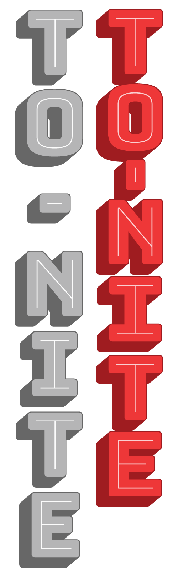
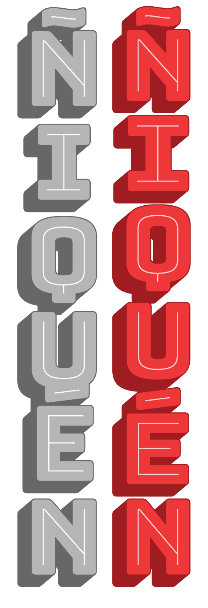
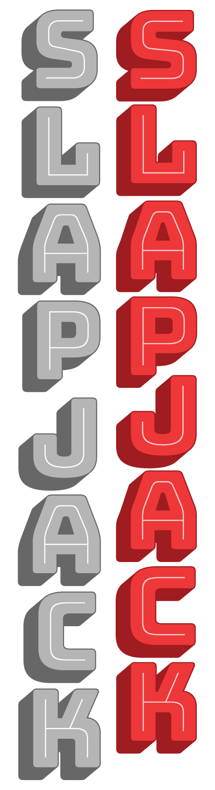
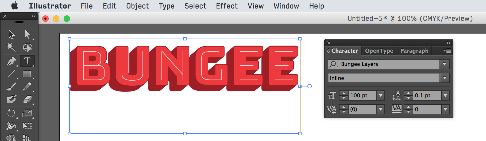
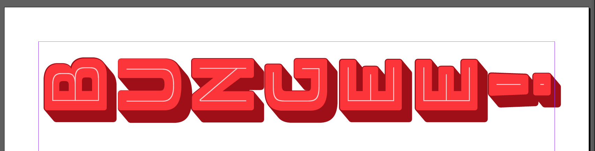
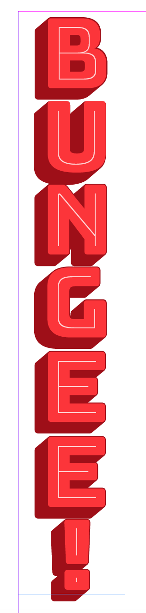

# Using vertical text

Bungee’s vertical features are implemented via three OpenType features:

### *vert*: Vertical Forms

This feature replaces the default horizontal forms with special glyphs drawn for vertical setting. These alternates appear to be monowidth so that they foster better vertical alignment. The hyphen and other basic punctuation are rotated 90°. Accented glyphs are drawn slightly shorter to optically compensate for the height of the diacritic.

### *vpal*: Vertical Positioning and Layout

This feature resets the glyphs’ vertical sidebearings and advance heights to create proportional vertical spacing. Instead of the fixed-height approach of setting each letter followed by a hard return, Bungee’s glyphs with accents or tails (like É or Q) occupy more vertical space than most characters, and optical adjustments are used to improve spacing (for example, the wide crossbar at the top of the letter 'T' is padded by more space than the narrow stem at the bottom).

### *vkrn*: Vertical Kerning

This feature adjusts the vertical spacing of individual glyph pairs so that they are more evenly spaced. These pairs often involve letters like P, F, L, and J, which have large areas of whitespace that need to be tightened when used in combination with certain other letters.

## In design apps

### The vertical text tool

Several professional design applications have separate vertical text tools, which will implement all of the necessary OpenType features and provide a nice interface for setting vertical text.

In most apps, the Character palette provides options for vertical tracking and kerning.

Desktop apps that natively support vertical text in one way or another include:

* Adobe Photoshop
* Adobe Illustrator
* Apple TextEdit

### Rotated text 

In apps that do not have native vertical text tools, the *Bungee Layers Rotated* family allows you to simulate vertical type. 

These fonts have Bungee’s vertical forms, spacing, and kerning baked in to the default forms, and all characters are rotated 90° counterclockwise. 

Set the text. 

Change the font family to *Bungee Layers Rotated*.

Finally, rotate the text block 90° counterclockwise. 

Voilà! Pseudo-vertical text.

Apps that do not support vertical text include:

* Google Docs
* Microsoft Word
* Apple Pages
* Adobe InDesign

## On the web

###  Writing-mode: *vertical-rl*

The proper way to implement vertical text is via the CSS **writing-mode** and **text-orientation** selector, as well as implementing. This will work in recent versions of IE, Firefox, and Chrome, but not in older browsers or Safari.

    

	
Bungee

	
Learn more about vertical writing modes at <http://generatedcontent.org/post/45384206019/writing-modes>
	
### Rotated text
	
Alternatively, use *Bungee Layers Rotated* fonts and a rotated div to simulate the effect. This will require you
to reposition the div using margins or absolute positioning.

	.rotated {
		font-family: "BungeeLayersRotated";
		-webkit-transform: rotate(90deg);
		-moz-transform: rotate(90deg);
		-o-transform: rotate(90deg);
		-ms-transform: rotate(90deg);
		transform: rotate(90deg);
	}
	
	
Bungee

* Previous: [Chromatic layers](2-chromatic-layers.md)
* Next: [Stylistic alternates](4-stylistic-alternates.md)
