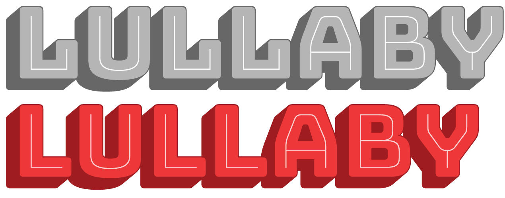
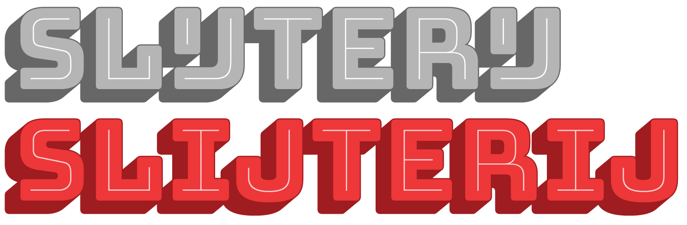

# Stylistic alternates

As a display font, Bungee is only intended for small bits of text, sometimes even single letters or words. Since an individual letter can play such a big part of a Bungee composition, Bungee comes with alternates that can help you fine-tune the look and feel of your text. 

Bungee’s stylistic alternates can be accessed using OpenType Stylistic Sets (ss01-ss20), or via the Glyphs palette in design apps.

## Stylistic Set 01: Vertical forms

Activate Bungee’s vertical forms (identical to the *vert* feature). These forms are better accessed through the vertical text features described above, but this stylistic set can be handy when such tools are not available, or when monowidth letters are required in a non-vertical setting.

## Stylistic Set 02: Round forms

Replace diagonal forms of A, M, N, W, X, and Y with deco-inspired alternates with round shapes and vertical sides. 

## Stylistic Set 04: Round E

Replace forms of E with an decorative alternate with a rounded left side.

## Stylistic Set 04: Sans-serif I

Replace the serifed I with an serifless alternate. Note: this is a very narrow character that may result in less-than-ideal vertical setting.

## Stylistic Set 05: Sans-serif L

Replace the default form of L with the more conventional form without a vertical serif.

	
## Stylistic Set 06: Alternate ampersand

Replace the default ‘ET’ ampersand with an alternate that resembles a stylized ‘E’ with a vertical stroke.
	

## Stylistic Set 07: Small quotes

Replace the curly apostrophe and matching left quote with smaller, less obtrusive versions.

## Stylistic Set 08: Sequential IJ

Replace the ligated IJ (U+0132) with two separate letterforms.
	

	
## Stylistic Set 09: John Downer’s recommendations

Sign painter and type designer John Downer warns against vertical type and lettering which includes problematic characters like I, J, L, M, and W, which are unusually narrow or wide. This feature disables those characters.

* Previous: [Vertical text](3-vertical-text.md)
* Next: [Ornaments](5-ornaments.md)
