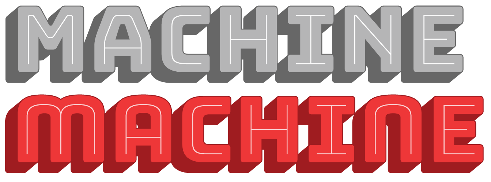
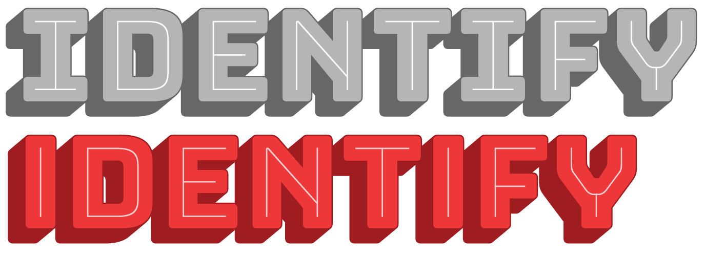
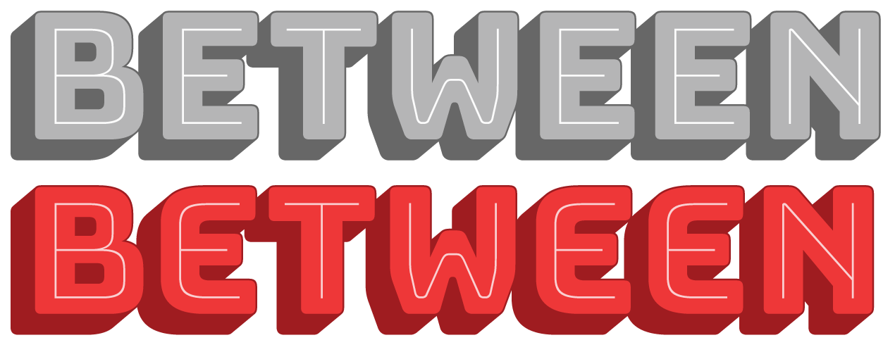
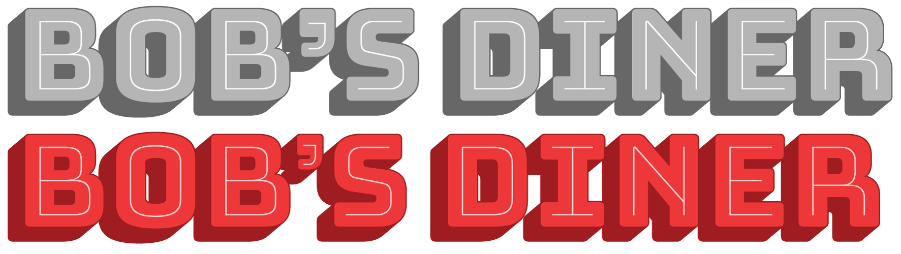
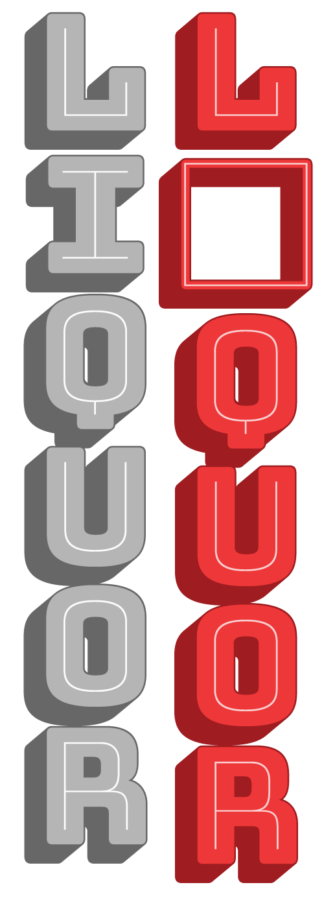
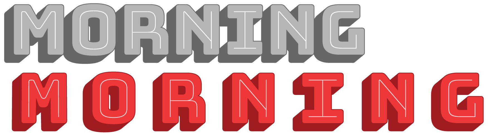

# Stylistic alternates

As a display font, Bungee is only intended for small bits of text, sometimes even single letters or words. Since an individual letter can play such a big part of a Bungee composition, Bungee comes with alternates that can help you fine-tune the look and feel of your text. 

Bungee’s stylistic alternates can be accessed using OpenType Stylistic Sets (ss01-ss20), or via the Glyphs palette in design apps.

## Stylistic Set 01: Round Forms.

Replace diagonal forms of A, M, N, W, X, and Y with deco-inspired alternates with round shapes and vertical sides. 

Each of these letters can also be implemented separately using the following stylistic sets:
	
	* Stylistic Set 05: Round A.
	* Stylistic Set 06: Round M.
	* Stylistic Set 07: Round N.
	* Stylistic Set 08: Round W.
	* Stylistic Set 09: Round X.
	* Stylistic Set 10: Round Y.
	
## Stylistic Set 02: Serifless I.

Replace wide, serifed I with an unserifed alternate. This is a very narrow character that may result in less-than-ideal vertical setting.

For all you Hawaiians out there, there’s also a special serifless II ligature!

## Stylistic Set 03: Round E.

Replace forms of E with an decorative alternate with a rounded left side.

	
## Stylistic Set 04: Alternate Ampersand.

Replace the default ‘ET’ ampersand with an alternate that resembles a stylized ‘E’ with a vertical stroke.
	

	
## Stylistic Set 12: Small Quotes.

Replace the curly apostrophe and matching left quote with smaller, less obtrusive versions.

## Stylistic Set 18: John Downer Recommendations.

Signpainter John Downer recommends against vertical type that includes problematic characters like I, M, and W, which are unusually narrow or wide. This feature disables those characters.

## Stylistic Set 20: Vertical forms.

Activate Bungee’s vertical forms (identical to the *vert* feature). These forms are better accessed through the vertical text features described above, but this stylistic set can be handy when such tools are not available, or when monowidth letters are required in a non-vertical setting.

## Minor opentype features

In addition to its stylistic alternates, Bungee also contains several OpenType Stylistic Sets for easy access to certain characters or alternate forms.

* Stylistic Set 11: Sequential IJ.
* Stylistic Set 13: Indexes (pointing hands).
* Stylistic Set 14: Alternate Indexes.
* Stylistic Set 15: Outlined Indexes.
* Stylistic Set 19: Primes.

* Previous: [Vertical text](3-vertical-text.md)
* Next: [Ornaments](5-ornaments.md)
