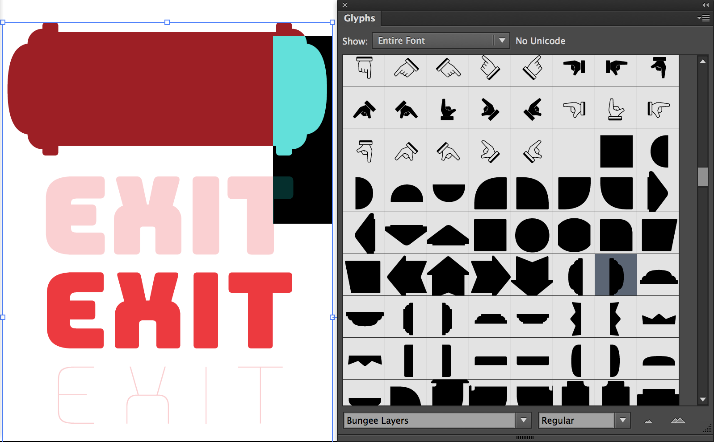

## Ornaments

In addition to its arrows and pointing indexes, Bungee has a nice set of ornaments that you can use to assemble additional chromatic layers.

Some ornaments are designed to connect seamlessly to other ornaments, which you can use to create continuous banners. If you center-align the entire text block, you will not have to worry as much about making the layers line up.

For example, you can compose a directional sign out of a half circle, two square blocks, and an arrowhead.

In design apps, ornaments can be easily accessed via the Glyph palette.

You can use horizontal scaling and tracking/letter-spacing to make minor adjustments to the positions.

Other ornaments can be set independently to encircle a single letter. Use these shapes behind Bungee’s vertical forms (accessible via the glyph palette, under Stylistic Set 20), since they are all approximately the same width. 

Add *280 units* to the alphabetical layers to make them line up with the independent ornaments.

Note that not all ornaments are available in Bungee’s Inline and Shade layers.
