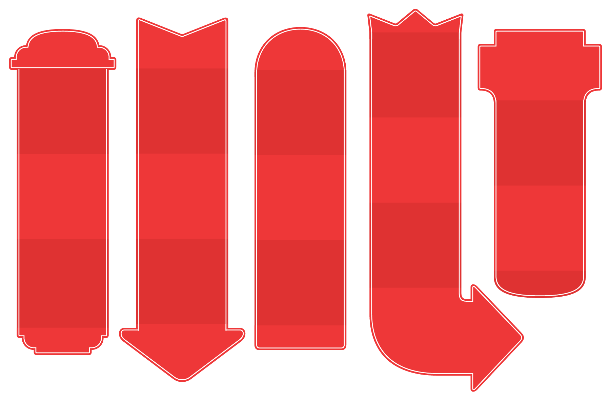
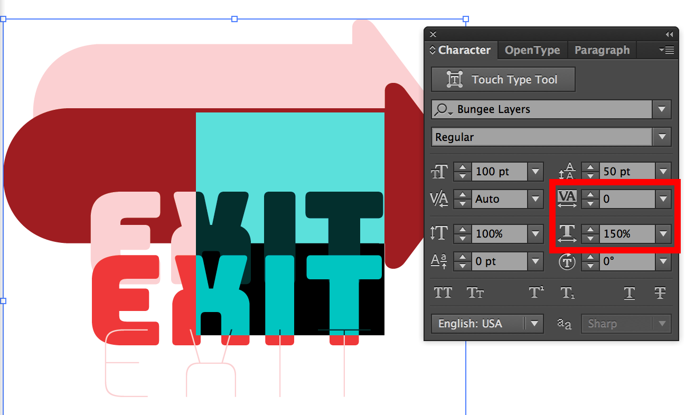
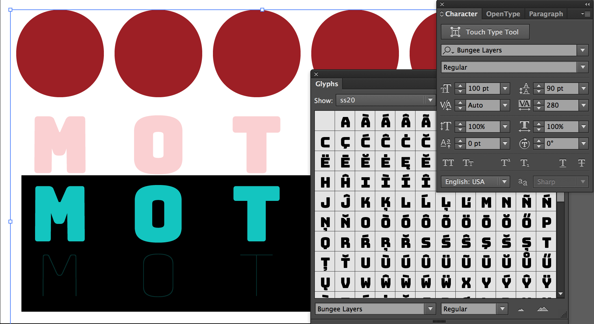

# Ornaments

Bungee comes with a fun set of arrows, indexes, and shapes that. 

Unicode values are assigned to ornaments when they are available. Otherwise, codepoints in the Private Use Area area are used. In design apps, ornaments can be easily accessed via the Glyphs palette. 

Note that not all ornaments are available in Bungee’s Inline and Shade layers.

## Arrows and Indexes

Bungee comes with a variety of straight and bent arrows, as well as four styles of pointing hands (two solid, two outlined).

## Shapes

### Banner Shapes

Some shapes are designed to connect seamlessly to other shapes, which you can use to create continuous banners. If you center-align the entire text block, you will not have to worry as much about making the layers line up.

For example, you can compose a directional sign out of a half circle, two square blocks, and an arrowhead.

You can use horizontal scaling and tracking/letter-spacing to make minor adjustments to the positions.

### Independent Shapes

Other ornaments can be set independently to encircle a single letter. When enclosing letters within independent shapes, use Bungee’s monowidth vertical forms (accessible via the Glyphs palette, under Vertical Forms or Stylistic Set 01).

Add *280 units* to the alphabetical layers to make them line up with the independent ornaments.

* Previous: [Stylistic alternates](4-stylistic-alternates.md)
* Next: [Editing Bungee](6-editing-bungee.md)
