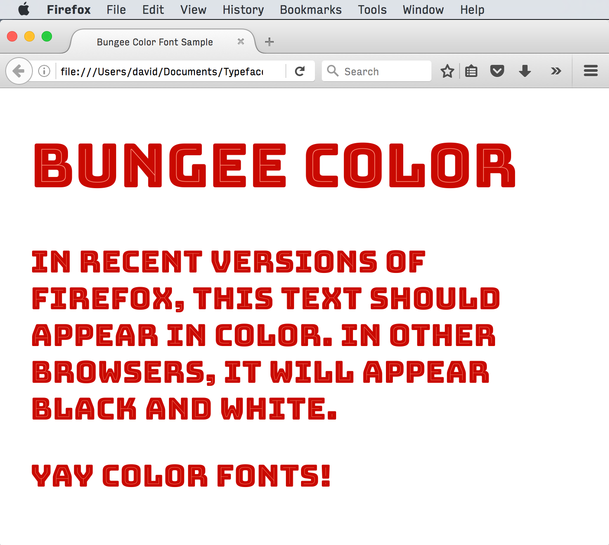
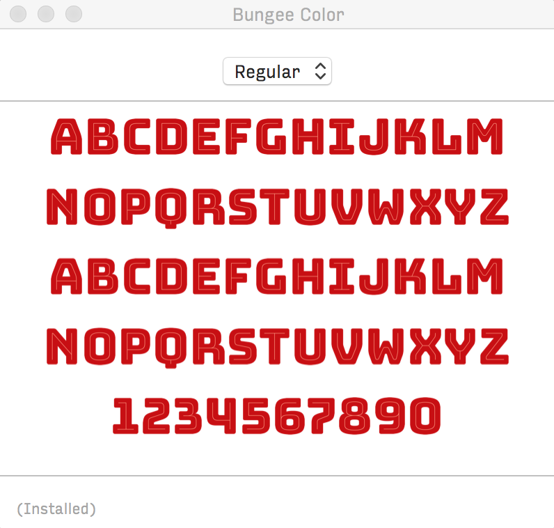

# Bungee Color

Thanks in large part to the popularity of Emoji, several specifications for color fonts have emerged in the past few years.

All three versions of Bungee Color are normal OpenType fonts with extra data added. These fonts were generated with Jens Kutílek’s incredible [Robochrome](https://github.com/fontfont/RoboChrome), and mastered with the help of [Roel Nieskens](https://pixelambacht.nl).

As of 2016, none of these formats are widely supported beyond the companies who proposed them. Color fonts are still an experimental technology, which is why I think it is important to have good open source examples to experiment with. I hope Bungee is helpful to the further development of these formats. 

## SVG ([Mozilla](https://hacks.mozilla.org/2014/10/svg-colors-in-opentype-fonts/))

This format simply embeds SVG images into the font. The WOFF version works well in recent versions of Firefox.

## COLR/CPAL ([Microsoft](https://www.microsoft.com/typography/otspec/colr.htm))

Bungee was one of the fonts that Microsoft used to test its format in 2013. Rather than embedding image data, Microsoft’s approach is to layer glyphs on top of each other. It defines two tables, one that governs how glyphs are layered, and another that defines color palettes.

## SBIX ([Apple](https://developer.apple.com/fonts/TrueType-Reference-Manual/RM06/Chap6sbix.html))

Apple’s format embeds PNG data into a special font table. It works in Mac OS X.

* Previous: [Ornaments](5-ornaments.md)
* Next: [Editing Bungee](7-editing-bungee.md)
